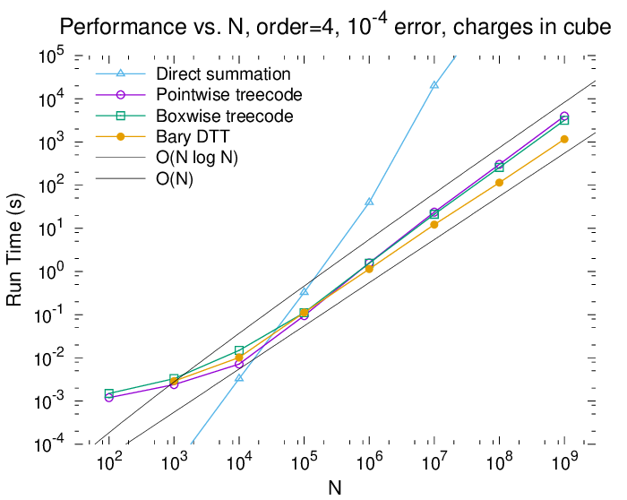
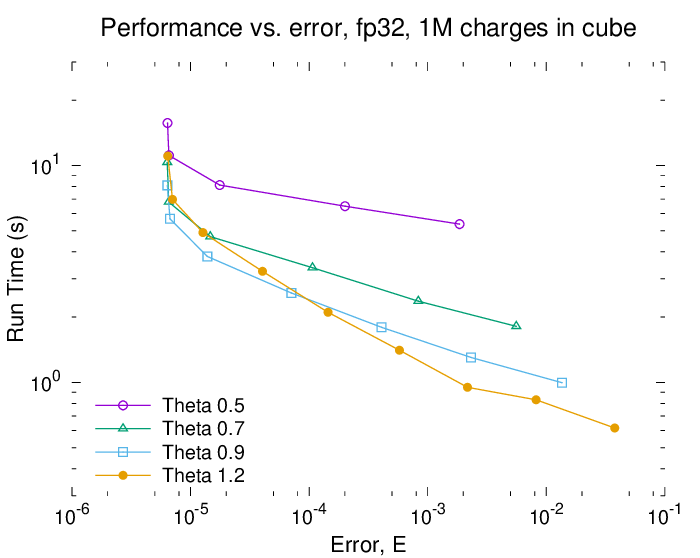

# onbody

Test C++ code for equivalent particle approximation technique and O(NlogN) and O(N) summation methods


## Summary

`onbody` is a testbed C++ library and driver program for a single evaluation of the forces
on a system of target points from a system of source particles (an "N-body" problem).

This is most easily understood in the context of gravitation, where all stars (masses) in a galaxy 
attract all other stars according to [Newton's law of universal gravitation](https://en.wikipedia.org/wiki/Newton%27s_law_of_universal_gravitation).
To find the forces between all of them on a computer, you would 
need to compute, for each star, the distance, direction, and then force that every other
star applies. This is a trivially easy algorithm to write, but it must perform about 
20 * N * N arithmetic operations to find all of the stars' new accelerations (where N is the
number of stars). This is called direct summation, and is an O(N^2) method, because the cost
is the second power of the problem size. For N<10,000, this is still quite fast, but galaxies
can easily contain 100 billion or more stars, not to even mention other forms of mass (planets,
dark matter, uncoalesced gases).

In this repository you'll find "treecodes"; these aim to make that calculation much faster,
theoretically C * N * log(N) operations, where C is some constant number (generally larger than 20).
Treecode algorithms, like [Barnes-Hut](https://en.wikipedia.org/wiki/Barnes%E2%80%93Hut_simulation),
are still relatively easy to program, but require some extra care to
optimize their performance on current computer hardware.
Finally, there are methods ([Fast Multipole Method](https://en.wikipedia.org/wiki/Fast_multipole_method), dual-tree-traversal, etc.) that 
can reduce the cost further to C * N operations (C is again a constant number, although 
it could be large), but at the cost of an even more intricate algorithm and more 
difficulty optimizing the code for peak performance.

The same mathematics and algorithms that work for gravitation problems also work for
a variety of other problems. Solving for electrostatic forces is identical to gravitation
with the exception that the "mass" of each source particle can be negative.
Similarly, incompressible fluid dynamics allows solutions where source particles
have a circulation property, and the same algorithms then solve for the resulting
velocity of those particles (called "vortex particle methods"). These are all
called [N-body problems](https://en.wikipedia.org/wiki/N-body_simulation),
hence the name of this repository.

Each of the codes in this package will set up a system of source and target points and
perform the naive direct summation, three treecodes, and a "fast" (O(N)) 
summation of all particles for that particular problem.


## Build and run

    sudo dnf install eigen3-devel cmake gcc-c++ libgomp
    mkdir Release
    cd Release
    cmake -DCMAKE_BUILD_TYPE=Release ..
    make
    ./ongrav3d -n=100000

Alternatively, configure the build to use another compiler with a command like:

    cmake -DCMAKE_CXX_COMPILER=/opt/gcc/gcc-6.3.0/bin/g++ -DCMAKE_BUILD_TYPE=Release ..

Note that the argument for the box-opening criterion (theta, also called the multipole acceptance
criterion "MAC") common to all treecodes is the reciprocal of what is commonly used.
Typically, theta=0.5 would mean that the source tree cell size is half of the distance
to the target point/cluster. In the codes here, that would be `-t=2` - we think of it as
the relative distance between the clusters is 2 times the cluster size.
A normal call to the gravitation solver would then look like this:

    ./ongrav3d -n=1000000 -t=2.0 -o=4

## Performance

The tests below were run on an AMD Threadripper 3945WX 12-core processor using the Sept 2025
version of this code compiled with GCC 14.3.1 with Vc and OpenMP and use a block size of 128 (`-b=128`).
All reported times are in wall-clock seconds reported with the high resolution timer from `std::chrono`.
Below is the performance of the `ongrav3d` program, coded to use charges instead of
masses (it is much harder to get high accuracy with + and - charges than with
always-positive masses), with `-t=1.11111` (MAC theta=0.9), 4th order interpolation
(`-o=4` or 5^3 Chebyshev points per tree node) and single-precision numbers for
storage and computation. RMS errors were around 1e-4.

N      | src tree | calc equivs |  direct  | pointwise | boxwise
-------|----------|-------------|----------|-----------|--------
1000   |  0.0017  |    0.0004   |  0.00003 |   0.0024  | 0.0033
10000  |  0.0023  |    0.0013   |  0.0033  |   0.0072  | 0.0149
100000 |  0.0088  |    0.0072   |  0.3289  |   0.0947  | 0.1111
1e+6   |  0.0879  |    0.0585   |  39.704  |   1.5827  | 1.5646
1e+7   |  0.9067  |    0.4713   |  20020.  |   23.652  | 21.128
1e+8   |  8.2903  |    4.6498   |  2.39e+6 |   303.74  | 256.06
1e+9   |  85.149  |    46.754   |  2.11e+8 |   3979.8  | 3174.4



The following two figures represent work performed on a 16-core AMD Ryzen 3950X with
`ongrav3d` compiled with GCC 13.2.0.
The first shows the effect of varying theta, the box-opening criterion, for 
the same example. Note that the theta mentioned here is the inverse of the `-t` argument.
This shows that a generous box-opening criterion can be used to achieve RMS errors
less than about 1e-4, while a moderate theta (0.9, `-t=1.1111`) can be used for 1e-4 to 1e-5.
The error asymptotes at 6e-6 because all storage and accumulations are done using 
32-bit `float` numbers.
Note here that if 1e-3 error is acceptable, this setup can perform the treecode summation
for 1 million particles in about 1 second using just the CPU.



Finally, we see the effect of changing the floating-point precision for data storage
and arithmetic accumulation. 32-bit floats are fastest down to about 1e-5 RMS error, 
then performing accumulations in fp64 allows the RMS error to drop to about 4e-6,
finally to achieve the most accurate results, numbers should also be stored as fp64.


## Theory

#### VAM-split k-d trees
N-body methods with better than O(N^2) performance must take on the extra cost of
organizing the particles into spatial data structures called trees (hence "treecode").
Most still use spatial octrees (or quadtrees in two dimensions) where each node of
the tree is a cube (square) and is placed in space in a grid-like arrangement.
Unless particles are positioned uniformly (which is rare), each node in the tree has
a different number of particles. This can cause inefficiencies when performing 
the tree traversals and force calculations because GPUs and modern CPU hardware
is most efficient when performing arithmetic in larger, power-of-two blocks
(like 4, 8, and 16 on CPUs and 64, 128, and 256 on GPUs).

We began using VAM-split k-d trees in 2007 to achieve peak performance on GPUs, and
they have been the core of all of our treecodes since.
A VAMsplit k-d tree has the same number of particles in every leaf node *except for
the last one*, and every level of the tree has that same property.
Say we have 1000 particles in a VAM-split k-d tree with leaf node size of 256 (this is
very efficient for N-body methods on GPUs). The root of the tree has all 1000 points,
the next level is split such that the left side has 512, and the right has the remainder (488).
The next level is split so that all leaf nodes have 256 except the last, which has 232.
Indexing into such a tree is also easy, if the root node is index i, its children are
2\*i and 2\*i+1.
The main difference between this and a standard octree is that the tree nodes are not
arranged in a grid.

#### Partial sorting for fast tree building
Generating a spatial tree always involves sorting particles, generally along one 
of the coordinate axes (if a collection of particles is much larger in the x direction
than the y or z, we sort along x to find the first split).
But it's easy to waste time by performing a full sort when only a partial sort is
necessary. In the code here, we perform a very fast partial sort along the longest
coordinate axis such that the left (low) portion of the collection has blocksize \* 2^n
particles, where n depends on the level of the tree.
This is a selection algorithm, where the task is to find the k-th smallest element in
an array (where k can be large), and our method looks more like Floyd-Rivest than QuickSelect.
It also leaves each partition of the array unsorted.
The pivots are almost always close to those predicted by linear interpolation because
at each level, the node positions along that axis are effectively random.

#### Equivalent particles
Treecodes and fast codes must generate approximations of both the source terms on the 
underlying particles and the outputs on the target points, and this is most typically
done with multipole expansions. Thus, these codes have two code paths to compute the
influence of a block of particles on a target: multipoles for faraway source blocks, 
and direct summations for closer ones.
What if a code could use same easy-to-program direct-summation-style for both?
The origin of this software was an experiment in designing such a code.

The "equivalent particle" technique is where, given a `blockSize` representing the number of particles in all but one leaf node, every other node in the tree contains `blockSize` "equivalent particles" which are used to compute the influence of that box on target points. A simple treecode requires only the source points to have equivalent particles; and in this sense, they act like the multipole approximation of that tree node. For an O(N) method, the target tree also uses this system, so that all but one node in every level of the tree contains exactly `blockSize` equivalent target points, onto which the sources' influences are calculated, and from which those influences are passed down to its child boxes' equivalent target points. This means that every box-box, box-particle, or particle-box interaction can use the exact same computation kernel: `blockSize` (equivalent) particles affecting `blockSize` (equivalent) target points. This should simplify the programming of an O(N) fast summation code considerably, as long as appropriate trees and equivalent particles can be created efficiently.

#### Barycentric Lagrange form
Instead of generating N/2 equivalent particles from a tree node with N particles, we instead
create K^D proxy particles at Chebyshev nodes of the 2nd kind and interpolate the tree nodes'
particles onto those. Depending on K, this creates a higher-order distribution of charges/masses
with which to perform long-range interactions.
See [Wang-Tlupova-Krasny 2020](https://ieeexplore.ieee.org/abstract/document/9150146) for details.
In essence, this dramatically improves accuracy with only a small cost to performance.

To use the original equivalent-particle method, simply omit the "order" argument in the call:

    ./ongrav3d -n=1000000 -t=1

And to use the barycentric Lagrange interpolation, include it:

    ./ongrav3d -n=1000000 -t=1 -o=4

## To Do

* Add logic that compares the number of equivalent points to the number of actual particles in a box and uses the particles for summation if there are fewer
* Specialize the general Parts class inside of each program, like ongrav3d should have a MassParts : Parts
* Allow the Parts constructor to take another Parts object and re-use its data? or otherwise have sources and targets be the same data (make it easier on the cache)
* Create a standard Barnes-Hut NlogN method with boxwise interactions (to complete the set of 4 basic treecodes)
* Support different kernels more easily (like one which takes source and target radii)
* Finish porting templated functions and casts to allow float/double/Vc classes in kernel functions
* Would it be a benefit to adjust the proxy particles' radii in addition to strength?
* Is it possible to use OpenGL to perform the tree walk and 64-on-64 evaluations? See [nvortexOpenGL](https://github.com/Applied-Scientific-Research/nvortexOpenGL) for sample code
* Use smarter or faster data structures in the O(N) list-building system
* Start pulling the various algorithms (naive, tree1, tree2, fast) into separate...what, classes?
* More generally, consider how to port this entire code to HIP
* Use C++20 concepts to restrict typenames to std::floating_point and std::integral
* Maybe also use std::span to pass non-owning array subsections to tree-builder routines?
* Finally, consider C++26 std::simd instead of Vc, when it gets more widely supported

## Credits

This program was written by Mark Stock; though thanks go to Prof. Krasny and collaborators for
their documentation of the barycentric Lagrange interpolation method: [BaryTree on github](https://github.com/Treecodes/BaryTree).

I don't get paid for writing or maintaining this, so if you find this tool useful or mention it in your writing, please please cite it by using the following BibTeX entry.

```
@Misc{onbody2022,
  author =       {Mark J.~Stock},
  title =        {onbody: A Multithreaded Kernel-Independent Treecode in C++},
  howpublished = {\url{https://github.com/Applied-Scientific-Research/onbody}},
  year =         {2022}
}
```

